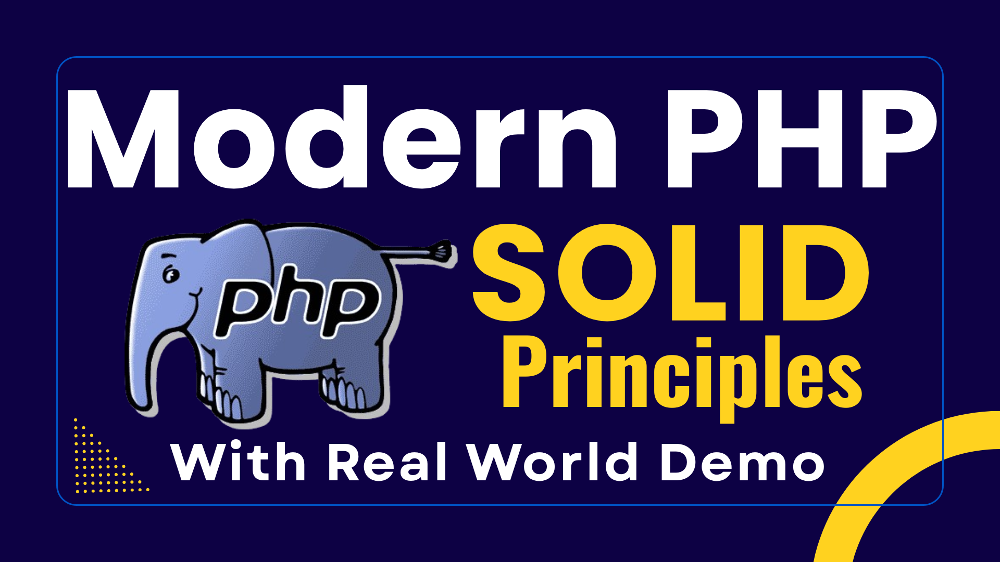

# SOLID Principles Using Modern PHP
SOLID is an acronym of five object oriented design principles by Robert C. Martin. These principles are essential guidelines for making code maintainable, scalable, loose coupling, flexible and stable.

## The S.O.L.I.D. Acronym

- Single Responsibility Principle (SRP)
- Open-Closed Principle (OCP)
- Liskov Substitution Principle (LSP)
- Interface Segregation Principle (ISP)
- Dependency Inversion Principle (DIP)

## SOLID Principles & Real World Demo

1. Single Responsibility Principle ([SRP](1_SRP/))
   
   -  [a. Bad Design](1_SRP/bad_design.php)  (Violation of SRP)
   -  [b. Good Design](1_SRP/good_design.php)  (Following SRP)

2. Open-Closed Principle ([OCP](2_OCP/))
   
   - [a. Bad Design](2_OCP/bad_design.php)  (Violation of OCP)
   - [b. Good Design](2_OCP/good_design.php) (Following OCP)

3. Liskov Substitution Principle ([LSP](3_LSP/))
   
   - [a. Bad Design](3_LSP/bad_design.php)  (Violation of LSP)
   - [b. Good Design](3_LSP/good_design.php)  (Following LSP)

4. Interface Segregation Principle ([ISP](4_ISP/))
   
   - [a. Bad Design](4_ISP/bad_design.php)  (Violation of ISP)
   - [b. Good Design](4_ISP/good_design.php)  (Following ISP)
    
5. Dependency Inversion Principle ([DIP](5_DIP/))
      
   - [a. Bad Design](5_DIP/bad_design.php) (Violation of DIP)
   - [b. Good Design](5_DIP/good_design.php)  (Following DIP)

# Modern PHP Features

- [x] Dependency Injection
- [X] Method Injection
- [x] Constructor Injection
- [X] Constructor property promotion
- [X] Named Parameters
- [X] Type hinting
- [X] Nullable Type 
- [X] Match Expression
- [x] Constructor Properties

